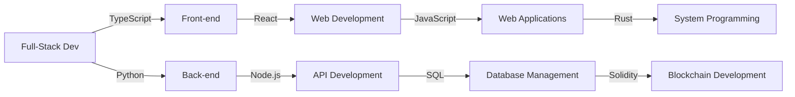

# Likhon Sheikh
================

**Full-Stack Dev** | TypeScript, Python, React, Node.js
================

## About
--------

Passionate and driven Full-Stack Developer with a strong command of both front-end and back-end technologies. Fluent in TypeScript and Python, I bring a versatile skill set to the table, enabling me to create dynamic and efficient web applications.

## Skills
--------

* **Langs**: TypeScript, Python, JavaScript, Rust, SQL, Solidity
* **Frameworks**: React, Node.js
* **Databases**: Relational, NoSQL
* **Project Management**: Agile, Scrum
* **Public Relations**: Marketing, Branding
* **Teamwork**: Collaboration, Leadership
* **Time Management**: Efficient, Productive
* **Leadership**: Mentorship, Guidance
* **Effective Communication**: Clear, Concise
* **Critical Thinking**: Analytical, Problem-Solving

## Experience
------------

* **Marketing Manager** @ Community Teams (2020-2024)
* **Full-Stack Dev** @ Paragen (2020-PRESENT)

## Education
------------

* **MSc Strategic Marketing** @ Wardiere University (2015-2030)
* **BSc Strategic Marketing** @ Wardiere University (2015-2029)

## Connect
----------

## Mind Map
------------

Let's build something amazing together!

Build Status
License

Note: I've used some placeholder URLs for the mindmap and build status/license badges. You can replace them with your own URLs.
		
