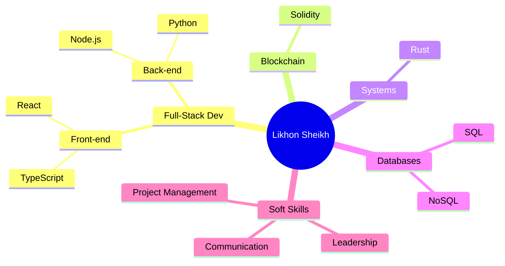

# Likhon Sheikh | Full-Stack Wizard 🧙‍♂️

## 🚀 Tech Stack

## 💼 Experience

- 🏛️ **CIO** @ [Yearn Cash](https://coinmarketcap.com/currencies/yearn-cash/#About)
- 💻 **Full-Stack Dev** @ [Paragen](https://launchpad.paragen.io/) (2020-PRESENT)
- 🌙 **Community Manager** @ [MoonSwap](https://moonswap.fi/about)

## 🎓 Education

- 🎓 **MSc Strategic Marketing** @ Wardiere University (2015-2030)
- 🎓 **BSc Strategic Marketing** @ Wardiere University (2015-2029)

## 📊 GitHub Stats

## 🧠 Skills Mind Map

## 🌟 Top Languages

## 🏆 GitHub Trophies

## 📈 Contribution Graph

---

  
  

Let's build something extraordinary together! 🚀

